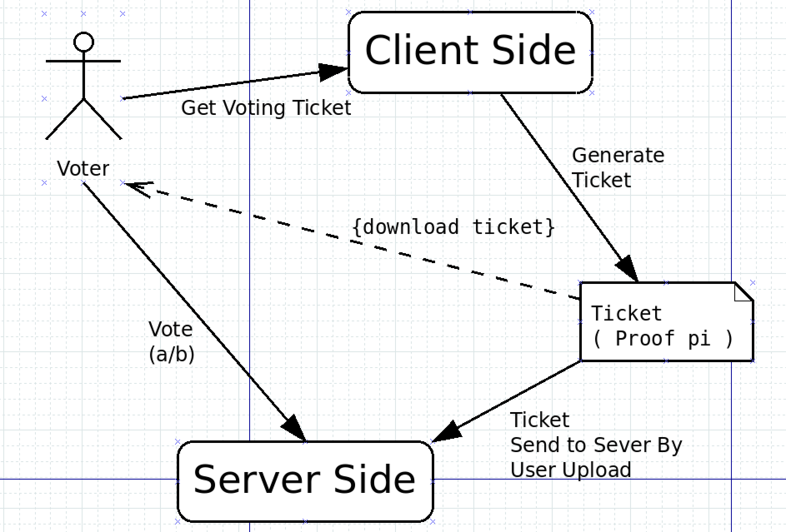
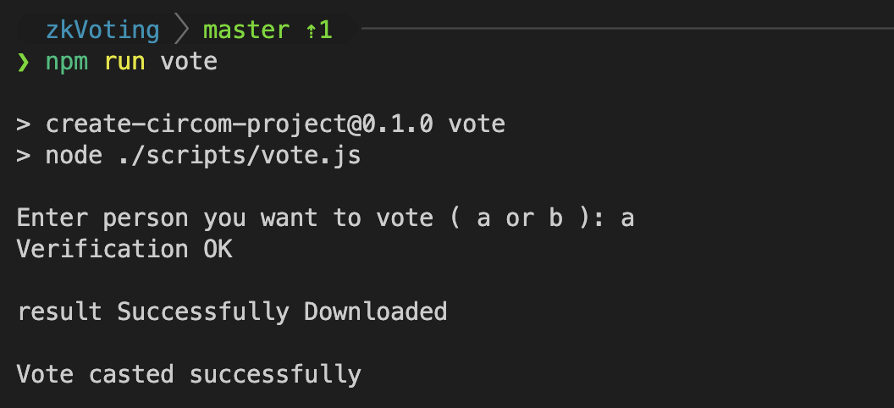

# Annonymous Voting System built with zk-SNARKS



Paper-based voting (like the Elections) is a very expensive way of voting. I have no exact data, but it costs billions of dollars, and it is always in the air that somebody cheated it.
A blockchain-based system costs only a fraction of this price, and it is super secure because the blockchain is public and everybody can track everything on it.
The only thing that is untrackable is that who voted to which party thanks to the zero-knowledge proof. So, blockchain-based voting seems like the holy grail of voting.

## How does it work?

The voting system registers the voters list and create a polling system. When the voter comes to the system the, it generates a ticket for them which they can use only once to vote.
The ticket is a zero-knowledge proof which proves that the voter is in the voters list and it is not used before. The ticket is generated by the voter's private key and the public key of the system.
</br>

</br>
When the voter comes to the polling system, it downloads the ticket from the system.
The system verifies the ticket and then the voter can vote to a party. The vote is also a zero-knowledge proof which proves that the voter is in the voters list and it is not used before and it is a valid vote.

## How to run the project
Install dependencies if you haven't already

- Clone this repository and then run the following commands
```bash
npm i
npm run start-poll
npm run download-ticket
npm run vote
```
There are many other commands in the `./package.json` file. You can run them by typing `npm run <command-name>`.

- To clean the existing build files
```bash
npm run clean
```

### Installing dependencies

- Install rust
```bash
curl --proto '=https' --tlsv1.2 https://sh.rustup.rs -sSf | sh
```
- Install circom
```bash
git clone https://github.com/iden3/circom.git
cd circom
cargo build --release
cargo install --path circom
```
- Install snarkjs
```bash
npm install -g snarkjs
```

- Others command that are important
```bash
npm run build
npm run setup
npm run generate-solidity
```


